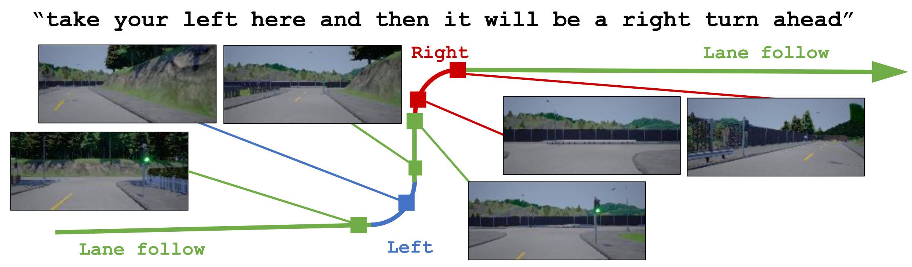

# Conditional Driving from Natural Language Instruction
This is an implementation of CoRL 2019 paper "Conditional Driving from Natural Language Instruction" by Roh et al. [[pdf]()][[project](https://sites.google.com/view/language-grounded-driving)]



## Citing the paper
If you use "Conditional Driving from Natural Language Instruction" in your research, please cite the paper:
```bibtex
@inproceedings{Roh2019Conditional,
  title={Conditional Driving from Natural Language Instruction},
  author={Junha Roh and Chris Paxton and Andrzej Pronobis and Ali Farhadi and Dieter Fox},
  booktitle={Proceedings of the Conference on Robot Learning},
  year={2019}
}
```

## Instruction to run the code
For running the code, we have to install the prerequisites, setup an environment, run simulators and then run the code.
You would be able to run the evaluation code if you follow the instruction step by step.

***WARNING: one of scripts contains the code that modifies your `~/.bashrc` file. Please make a copy of your `~/.bashrc` file.***

### Install prerequisites and environment
We recommend using `anaconda` to setup the environment for the code.
Here's a list important libraries that are used in the code:
* python==3.7
* pytorch==1.2
* tensorflow-gpu==1.14

These libraries will be installed if you follow the guide below.

#### Install guide
1. Install anaconda: either by manually or running `bash install_anaconda.sh`.
1. Setup an anaconda environment by running `bash config_env.sh`.
1. Activate the environment by running `conda activate carla_env`.
1. With the conda environment `carla_env` activated, run `pip install -r requirements.txt`.
1. Run `bash run.sh` to download and extract CARLA and checkpoint files for the experiment.

### Run simulator with a specific port
We have to specify the index of town (`Town1` or `Town2`) and the port to communicate with.
Here's an example for launching the simulation with (Town1, 5555) and (Town2, 6666).
Let us set `${ROOT}` a directory that you extract the code.
```
cd ${ROOT}/.carla/carla && DISPLAY=: ./CarlaUE4.sh /Game/Carla/Maps/Town01 -benchmark -fps=10 -carla-port=5555
cd ${ROOT}/.carla/carla && DISPLAY=: ./CarlaUE4.sh /Game/Carla/Maps/Town02 -benchmark -fps=10 -carla-port=6666
```
Normally the simulator should run forever.

### Run the evaluation code
Before running the code, we have to set the `$PYTHONPATH` to load the `CARLA` library.
Then we will call `evaluator.py` with the experiment name.
You can find evaluation settings from json files in `$ROOT/.carla/settings/experiments`.
In the json file, port, pretrained model, and evaluation sentence types are specified.
Make sure that the setting here matches the information of the simulation you launched.
If the experiment setting uses `semantic1` in `data`, then the simulation must load `Town01`, as well as the port.
By default, `gs-town1` uses (`Town01`, 5555), and `gs-town2` uses (`Town02`, 6666).
Now you can launch evaluation as below.
```
source env.sh
python evaluator.py gs-town1
```
Evaluation output will be saved to `${ROOT}/.carla/evaluations/exp${EXP_NUM}/${EXP_NAME}/step${STEP_NUM}`.
You may need to run `unset PYTHONPATH` before running `source env.sh` depending on your system setup.
We have experiment settings `bgr-town1`, `bgr-town2`, `gs-town1`, `gs-town2`, `ls-town1`, `ls-town2`.
These will test our model with three observation types in two towns.   

#### Interactive evaluation
You can also try the interactive evaluation with
```
source env.sh
python evaluator.py gs-town1 --online
```
This evaluation will be finished as the agent achieved the sentence direction.
You can change the language direction by pushing keyboard buttons.
This is a list of mapped character to keywords:

```
'j': 'left',
'k': 'straight',
'l': 'right',
'u': 'left,left',
'i': 'left,straight',
'o': 'left,right',
'm': 'right,left',
',': 'right,straight',
'.': 'right,right',
'1': 'straight,straight',
'2': 'firstleft',
'3': 'firstright',
'4': 'secondleft',
'5': 'secondright'.
```

The output files will be saved to `${ROOT}/.carla/evaluations/exp${EXP_NUM}/${EXP_NAME}/step${STEP_NUM}/online`.

### Summarization
If the evaluation is finished, you can run summarizer to see quantitative results as below.
```
python summarizer.py experiment gs-town1 1
```
If you use the output in town2, then you should also change the last index like below:
```
python summarizer.py experiment gs-town2 2
```
Output file will be generated to `${ROOT}/.carla/evaluations/summary/${EXP_NAME}.html`.
